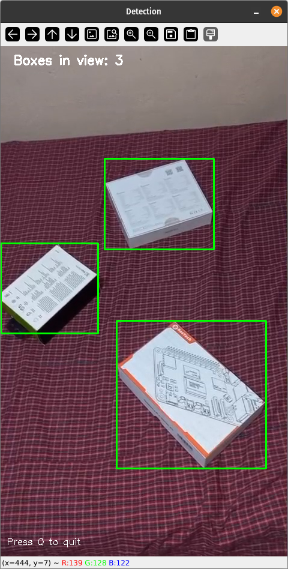
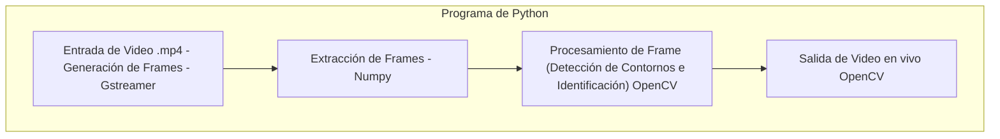
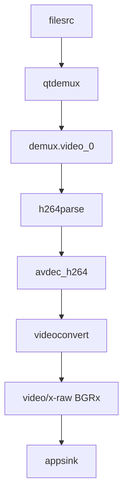
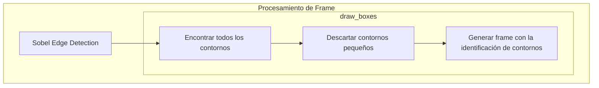

# Sistema detector de Cajas (Contornos)

> En este repositorio se realiza el desarrollo de un sistema operativo custom utilizando la herramienta de **Yocto Project**. Se utiliza **Gstreamer** con su sistema de pipelines para poder obtener componentes multimedia, además se utiliza **OpenCV** para realizar el procesamiento de las imagenes.

<p align="center">
   
</p>

##  Desarrolladores
El sistema fue desarrollado por:

- Nagel Eduardo Mejía Segura
- Oscar Gonzalez Cambronero
- Wilberth Gutierrez Montero

## Tabla de Contenidos


1. [Caracteristicas del Host](#caracteristicas-del-computador-host)
2. [Herramientas de Desarrollo](herramientas-de-desarrollo-y-requisitos)
    - [Yocto-Project](yocto-project)
    - [Gstreamer](gstreamer)
    - [OpenCV](yocto-project)
    - [Virtual-Box](virtual-box)
3. [Estructura del proyecto](estructura-básica-del-proyecto)
4. [Flujo de Trabajo](descripcion-del-flujo-trabajo)
5. [Generación de Imagen](generacion-de-imagen-custom)
    - [Proceso de Sintesis de Imagen](proceso-de-sintesis-de-imagen)
6. [Instalación en VirtualBox](instalacion-en-virtualbox)
7. [Referencias](referencias)

## Caracteristicas del Computador Host

- **Fabricante**:
- **Modelo**:
- **Sistema Operativo y Arquitectura**:
- **CPU y Nucleos**:
- **Capacidad RAM**:
- **Almacenamiento**:

## Herramientas de Desarrollo y Requisitos

### Yocto Project
Herramienta para customizar y generar imagenes de Linux.

**Requiere**:
  - 90 GB de disco duro libre minimo
  - 32 GB de RAM (Mejor perfomance en construcción)
  - Distribución de Linux
  - Dependencias:
      - Git 1.8.3.1
      - tar 1.28
      - Python 3.9.0
      - gcc 10.1
      - GNU make 4.0

### Gstreamer
Herramienta para generar pipelines de flujo multimedia

**Requiere**:
  - Distribución Linux (mejor compatibilidad)
  - Python o C++ (inclusión en códigos)

### OpenCV
Herramienta para visión por computadora, permite procesar imagenes.

### Virtual Box
Programa de Virtualización

**Requiere**:
  - Arquitectura de 64 bits
  - Recomendación asignar 4 GB de RAM
  - Minimo asignar 3 nucleos
  - Soporte de Virtualización (BIOS-UEFI)

## Estructura básica del proyecto

```
├── meta-python-scripts
│   ├── conf
│   │   └── layer.conf
│   └── recipes-python
│       └── python-scripts
│            ├── files
│            │   └── python-scripts-1.0
│            │       ├── boxdetector.py
│            │       ├── edgedetect.py
│            │       ├── hello_python.py
│            │       ├── inputs
│            │       │   └── box_test.mp4
│            │       ├── main.py
│            │       └── src
│            │           ├── detector.py
│            └── python-scripts.bb
└── build
    └── conf/
        ├── bblayers.conf
        └── local.conf

```

## Descripción del Flujo de Trabajo

Se observa el diagrama general del programa de Python, primero se tiene de entrada el video en formato .mp4, se realiza la extracción de frames obteniendo un array con numpy. Seguidamente es procesado por medio de OpenCV, se realiza la detección de Contornos y se dibujan los contornos encontrados, por ultimo, se utiliza OpenCV para mostrar la imagen.


---

### Pipeline de Gstreamer 



---

### Diagrama de Procesamiento de Imagen



## Generación de Imagen Custom

Si el sistema host cumple con los requisitos se puede empezar por instalar los siguientes paquetes

> [!NOTE]
> Para el ejemplo se está tomando una distribución basada en Ubuntu

```bash
sudo apt-get install build-essential chrpath cpio debianutils diffstat file gawk gcc git iputils-ping libacl1 liblz4-tool locales python3 python3-git python3-jinja2 python3-pexpect python3-pip python3-subunit socat texinfo unzip wget xz-utils zstd
```

Seguidamente se puede clonar el repositorio, notese que se pasa directamente a un branch, exactamente el de `gstreamer-walnascar` que es donde se encuentra el desarrollo de la aplicación:

```bash
git clone -b gstreamer-walnascar git@github.com:OscarM2023/pokymod_n_gstreamer.git
```

Si bien el repositorio está hecho para poder generar la imagen immediatamente se pueden observar algunos detalles primarios. 

En el directorio `meta-python-scripts` se encuentran la estructura de la aplicación, donde hay un directorio `recipes-python/python-scripts/files` donde se encuentran los scripts de python de los programas. Tambien se encuentra la receta `python-scripts.bb` que contiene lo siguiente

```bash
SUMMARY = "Python scripts collection"
LICENSE = "MIT"
LIC_FILES_CHKSUM = "file://${COMMON_LICENSE_DIR}/MIT;md5=0835ade698e0bcf8506ecda2f7b4f302"

SRC_URI = "file://python-scripts-1.0"

do_patch[noexec] = "1"
do_configure[noexec] = "1"
do_compile[noexec] = "1"

do_install() {
    install -d ${D}${bindir}
    
    echo "Contents of WORKDIR:"
    ls -la ${WORKDIR}/
    echo "Contents of python-scripts-1.0:"
    if [ -d "${WORKDIR}/python-scripts-1.0" ]; then
        ls -la ${WORKDIR}/python-scripts-1.0/
    else
        echo "python-scripts-1.0 directory does not exist!"
    fi

    for pyfile in ${WORKDIR}/python-scripts-1.0/*.py; do
        if [ -f "$pyfile" ]; then
            echo "Installing: $pyfile to ${D}${bindir}/"
            install -m 0755 "$pyfile" ${D}${bindir}/
        else
            echo "File not found: $pyfile"
        fi
    done

    cp -r ${WORKDIR}/python-scripts-1.0/inputs ${D}${bindir}/
    cp -r ${WORKDIR}/python-scripts-1.0/src ${D}${bindir}/
    
    echo "Final contents of ${D}${bindir}:"
    ls -la ${D}${bindir}/
}

FILES:${PN} = "/usr /usr/bin ${bindir}/*"

RDEPENDS:${PN} = " \
    python3-core \
    python3-numpy \
    python3-pygobject \
    opencv \
    python3-opencv \
    gstreamer1.0 \
    gstreamer1.0-plugins-base \
    gstreamer1.0-plugins-good \
    gstreamer1.0-plugins-bad \
    gstreamer1.0-libav \
"
```


Realiza lo siguiente:
  - `SRC_URI`: Indica adonde están las fuentes del paquete o programa
  - `do_install()`:
      - Se itera por cada archivo .py y los instala con permisos de ejecutable.
      - Copia el archivo de video y el src que necesita el programa para ejecutarse correctamente.
  - `FILES:${PN}`: Se incluyen los archivos que forman parte del paquete
  - `RDEPENDS:${PN}`: Define los paquetes necesarios para que funcione el programa

En el directorio de configuraciones de la construcción `build/conf/` hay dos archivos importantes el `bblayers.conf` el cual ya contiene las layers necesarias para que el sistema funcione, además para no agregarlas a mano.

```bash
# POKY_BBLAYERS_CONF_VERSION is increased each time build/conf/bblayers.conf
# changes incompatibly
POKY_BBLAYERS_CONF_VERSION = "2"

BBPATH = "${TOPDIR}"
BBFILES ?= ""

BBLAYERS ?= " \
  ${TOPDIR}/../meta \
  ${TOPDIR}/../meta-poky \
  ${TOPDIR}/../meta-yocto-bsp \
  ${TOPDIR}/../meta-openembedded/meta-oe \
  ${TOPDIR}/../meta-openembedded/meta-python \
  ${TOPDIR}/../meta-openembedded/meta-multimedia \
  ${TOPDIR}/../meta-python-scripts \
  "
```

Las principales capas añadidas son las siguientes:

- `meta-python`: Capa para recetas relacionada al interprete de Python
- `meta-multimedia`: Capa con recetas para procesamiento multimedia (Gstreamer)
- `meta-python-scripts`: Capa donde se encuentra la aplicación desarrollada

---

El otro archivo principal es el **`local.conf`**, entre los primeros aspectos importantes se encuentra la target machine seleccionada:

```bash
MACHINE ?= "qemux86-64"
```
Se seleccionó la maquina qemu para facilidad de virtualización, así como testeo rápido en QEMU en caso de que no se pueda en VirtualBox.

En la parte inferior del archivo, se tienen la mayoría de configuraciones importantes:

```bash
# Que la imagen también salga en formato VMDK (VirtualBox lo acepta)
IMAGE_FSTYPES += " wic.vmdk"

# Paquetes base de opencv/gstreamer
IMAGE_INSTALL:append = " \
  python3-core python3-numpy python3-opencv xauth \
  gstreamer1.0 gstreamer1.0-plugins-base gstreamer1.0-plugins-good \
  gstreamer1.0-plugins-bad gstreamer1.0-libav\
  "

PACKAGECONFIG:append:pn-gstreamer1.0-plugins-bad = " opencv"

IMAGE_INSTALL:append = " python3"
IMAGE_INSTALL:append = " python3-pip"
IMAGE_INSTALL:append = " python3-numpy"
IMAGE_INSTALL:append = " opencv"
IMAGE_INSTALL:append = " python3-opencv"

# (Opcional) que OpenCV venga con backend GStreamer habilitado
PACKAGECONFIG:append:pn-opencv = " gstreamer"
LICENSE_FLAGS_ACCEPTED:append = " commercial"

# Habilita systemd
INIT_MANAGER = "systemd"
DISTRO_FEATURES:append = " systemd"
DISTRO_FEATURES:remove = "sysvinit"

# Evita que se te “backfille” sysvinit de nuevo
DISTRO_FEATURES_BACKFILL_CONSIDERED:append = " sysvinit"

# Cambiar el usuario
hostname:pn-base-files = "edge-detector"

# Añadir SSH
EXTRA_IMAGE_FEATURES += "ssh-server-openssh"

# Añade Python scripts
IMAGE_INSTALL:append = " python-scripts"
```

### Proceso de Sintesis de Imagen

Habiendo observado lo importante, se puede iniciar a levantar el ambiente para la construcción, en e directorio general de repositorio se va a utilizar el siguiente comando.

```
source oe-init-build-env 
```

Automaticamente se posiciona en el directorio de build, seguidamente se pueden observar los layers disponibles, por medio de:

```
bitbake-layers show-layers
```

Se debería observar lo siguiente:

```
NOTE: Starting bitbake server...
layer                 path                                                                    priority
========================================================================================================
core                  /home/nagel/pokymod_n_gstreamer/build/../meta                           5
yocto                 /home/nagel/pokymod_n_gstreamer/build/../meta-poky                      5
yoctobsp              /home/nagel/pokymod_n_gstreamer/build/../meta-yocto-bsp                 5
openembedded-layer    /home/nagel/pokymod_n_gstreamer/build/../meta-openembedded/meta-oe      5
meta-python           /home/nagel/pokymod_n_gstreamer/build/../meta-openembedded/meta-python  5
multimedia-layer      /home/nagel/pokymod_n_gstreamer/build/../meta-openembedded/meta-multimedia  5
meta-python-scripts   /home/nagel/pokymod_n_gstreamer/build/../meta-python-scripts            6
```

Tras verificar que se las capas son las correctas, se puede generar la imagen por medio del comando:

```
bitbake core-image-minimal
```
> [!CAUTION]
> La construcción de la imagen con BitBake puede ser lenta y consumir muchos recursos,
> lo que puede afectar el rendimiento del equipo durante la construcción.

## Instalación en VirtualBox

## Referencias

Paǵina de gstreamer: https://gstreamer.freedesktop.org/

Yocto Project: https://docs.yoctoproject.org/

OpenCV: https://docs.opencv.org/4.x/d9/df8/tutorial_root.html

Detector Robusto de Contornos: https://github.com/KEG012/Project_openCV_Box_Detector
